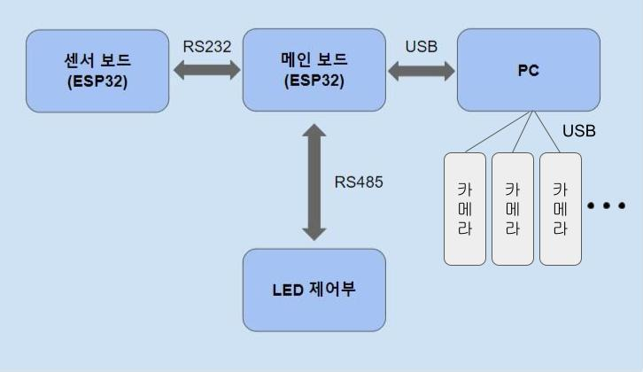

#### [누에]
***
[개요]  

#### [회로]
* 메인보드 : RS232 모듈, RS485 모듈, DC 전원, ESP32
* 센서보드 : RS232 모듈, 센서 모듈, ESP32

#### [펌웨어]
* 메인보드 <-> PC (자체 프로토콜)
* 센서보드 <-> 메인보드 (자체 프로토콜)
* 메인보드 <-> LED 제어부 (modbus 프로토콜)

#### [윈도우 프로그램]
* 실시간 화면
* 화면 녹화
* LED 제어
* 센서 정보 확인 등

### ※ 윈도우 프로그램 빌드할때 플랫폼 CPU를 x86으로 설정해주세요
